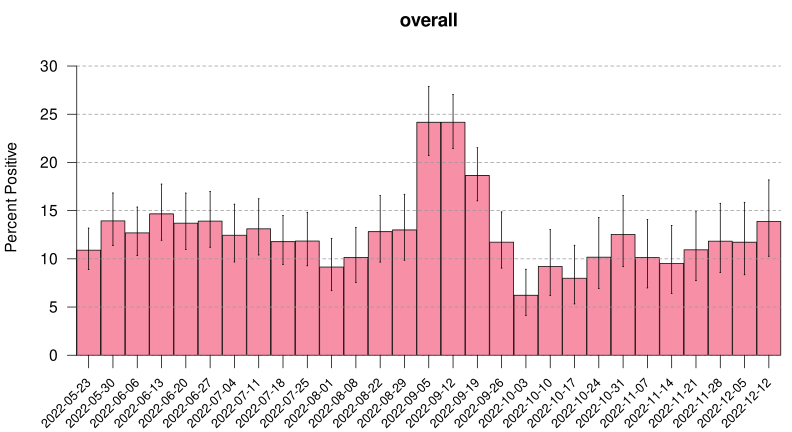

## UW-Madison COVID data, 2022

Plot of data from the [UW-Madison COVID
dashboard](https://covidresponse.wisc.edu/dashboard/)
after the revisions on 2022-06-06, where data is now just presented as
weekly counts.
Scraped into [`uw_covid_2022.csv`](uw_covid_2022.csv) using a
[python script](https://github.com/kbroman/UWCovid2022/blob/main/scrape_data.py)
based on the
[gist](https://gist.github.com/dgfitch/b6ca1cc61b4795e698cefdf672a90f23)
from [Dan Fitch](https://github.com/dgfitch).

We need the R package [lubridate](https://lubridate.tidyverse.org) and
the python module [requests_html](https://pypi.org/project/requests-html/).

Here, just calculating and plotting the test positivity.
The shaded regions are pointwise 95% confidence intervals.
The source is in [`README.Rmd`](https://github.com/kbroman/UWCovid2021/blob/main/README.Rmd).

