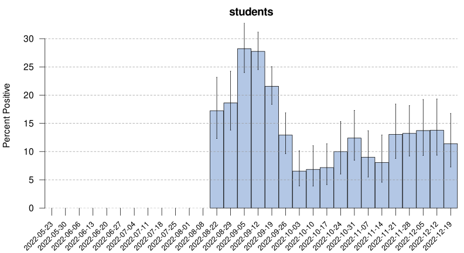
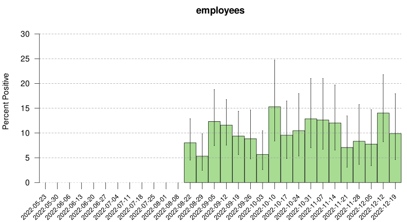

## UW-Madison COVID data, 2022

Plot of data from the [UW-Madison COVID
dashboard](https://covidresponse.wisc.edu/dashboard/)
after the revisions on 2022-06-06, where data is now just presented as
weekly counts. And then on 2022-06-20, they stopped providing separate
counts for students and employees, and began to just give totals.

Scraped into [`uw_covid_2022.csv`](uw_covid_2022.csv) using a
[python script](https://github.com/kbroman/UWCovid2022/blob/main/scrape_data.py)
based on the
[gist](https://gist.github.com/dgfitch/b6ca1cc61b4795e698cefdf672a90f23)
from [Dan Fitch](https://github.com/dgfitch).

We need the R package [lubridate](https://lubridate.tidyverse.org) and
the python module [requests_html](https://pypi.org/project/requests-html/).

Here, just calculating and plotting the test positivity.
The vertical line segments indicate pointwise 95% confidence intervals.
The source is in [`README.Rmd`](https://github.com/kbroman/UWCovid2021/blob/main/README.Rmd).

Note that up to the week of August 15, we were only getting aggregate
data. Starting the week of August 22, they began releasing separate
data on students and employees, again.

